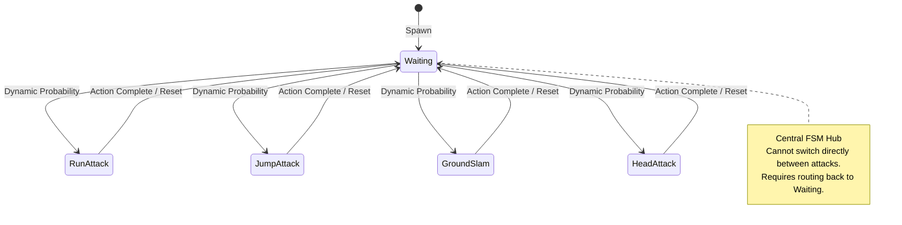

---
{
  "title": "EL POLLO DIABLO",
  "subtitle": "Technical System Architecture Case Study",
  "theme": "pollo",
  "meta_title": "El Pollo Diablo | Technical Case Study",
  "meta_description": "Technical engineering breakdown of El Pollo Diablo: 2D side-scrolling boss AI FSM and asymmetric local multiplayer input routing.",
  "meta_items": [
    {"label": "Engine & Language", "value": "Unity / C#"},
    {"label": "Architecture", "value": "Event-Driven FSM"},
    {"label": "Target Role", "value": "Gameplay / Systems Engineer"},
    {"label": "Development", "value": "Solo (UI Assets by Friend)"}
  ],
  "video_url": "https://youtu.be/7LcFI-s4p_8",
  "cover_image": "el-pollo-diablo-cover.jpg"
}
---

# 1. Project Vision

Named after the legendary mutant chicken myth in *The Curse of Monkey Island*, **El Pollo Diablo** is a 2D side-scrolling combat demonstration. Bypassing traditional platforming sequences entirely, the game focuses on technical systems engineering and combat design across two modes:

::: polish-grid
::: polish-card 1. Single-Player Boss Fight Mode
The player controls the Prisoner, fighting a campaign against the AI-controlled mutant chicken boss (*El Pollo Diablo*), whose complex attack behaviors are governed by a 12-state Finite State Machine (FSM).
:::
::: polish-card 2. Local Asymmetric Multiplayer Mode
A PvP match where Player 1 controls the agile, melee-focused Prisoner (utilizing a throwable boomerang), and Player 2 takes direct, hardware-routed control of the massive boss chicken, utilizing charge attacks, slams, and minion spawns.
:::
:::

Developing a single, decoupled codebase capable of handling both modes—integrating AI decision trees, routing distinct hardware maps, and balancing asymmetric combat—was the main engineering challenge of this project.

---

# 2. Technical Architecture & Module Structure

The architecture utilizes Unity’s modular component model, extended with custom decoupled modules, custom state machines, and event-driven patterns to handle cross-system coordination without circular references.

::: arch-diagram
::: arch-column Player Systems
- Input Routing
- Locomotion & Jump
- Dash Module
- Melee Controller
- Throwable Weapon Broker
- Status Effect Registry
- Physics Translation Module
:::
::: arch-column Boss AI & Attack Modules
- StateController (FSM)
- Target Acquisition
- BaseAttack Interface
- ChargeAttack Module [Teammate]
- LevitateAttack Module [Teammate]
- GroundSlam Module [Teammate]
- HeadAttack Module [Teammate]
- Boss Controller Broker
- Hitbox Overlap Solvers
:::
::: arch-column Shared Core Systems
- Decoupled Health Model
- Health Utility Extensions
- Collision Matrix Layers
- Dynamic Projectile Solver
- Global HitStop Broker
- Interpolation Camera
- Visual ScreenShake API
- Parallax Depth Solver
- Device-Routing Assigner
:::
:::

---

# 3. Key Technical Systems — Deep Dive

### 3.1 Throwable Boomerang Weapon [tech-pill: State FSM & Physics Sweep]

::: challenge
Implementing a highly-dynamic throwable weapon that flies horizontally, bounces off environments at calculated geometric reflection angles, and returns reliably to a moving player—while avoiding collision tunneling at high speeds and mitigating coupling conflicts.
:::

::: solution
Designed a state-managed projectile driven by a local finite state machine: `Possessed → Flying → Bouncing → Grounded`.
- **Discrete Collision Mitigation:** To prevent physics tunneling (skipping walls at high velocity), discrete calculations were replaced with `Physics2D.CircleCast` sweep tests. This scans the vector path between frames, catching geometry impacts before rendering next positions. Max-range exhaustion transitions the state to Grounded.
- **Geometric Reflection:** On collision, a parametric ricochet vector calculates a precise 60° bounce using force decomposition (`forceY = forceX * tan(60°)`). Custom vertical force updates are managed dynamically in `FixedUpdate` for predictable physics trajectories without reliance on unstable physics materials.
- **Boundary Solvers & Catch Handshake:** To prevent off-screen loss, boundaries trigger reflection offsets, and a floor boundary limits falling. A `catchDelay` window prevents immediate player collision detection on throw; when expired, trigger-overlap triggers a catch event, reparenting the weapon transform.

::: refinement Event-Driven Decoupling
The weapon executes updates via C# `Action` delegates (`onThrow`, `onCatch`). The player controller listens to these events to disable/enable other actions (like melee swings) without directly referencing or controlling the weapon object.
:::
:::

### 3.2 Dynamic Interpolation Camera System [tech-pill: Target Hysteresis]

::: challenge
Maintaining visual focus on asymmetric targets that move independently across the screen. The camera needed to track targets smoothly, look ahead in the direction of movement, and frame dynamic enemies without boundary jitter or screen-shake drift.
:::

::: solution
Created an interpolation camera system featuring three key layers:
- **Dead-Zone Slack:** Employs a bounding threshold. The camera remains stationary while the primary target moves within the boundary, responding only when the target intersects the threshold to minimize micro-jitter.
- **Velocity Look-Ahead:** Shifts the camera's target offset in the direction of movement using `Mathf.Lerp`, giving players visual warning of incoming environmental elements.
- **Hysteresis Buffer:** Targets register with a camera magnet service. Jitter caused by targets lingering at the tracking radius edge is resolved using a hysteresis buffer: active tracked targets receive a 1.5x radius bonus, requiring them to move significantly further to break focus.
- **Shake Isolation:** Visual screen-shake calculations are offset on a secondary child transform. This isolates screen shake from the main camera lerp tracking, preventing temporary shake from permanently drifting the base target coordinates.
:::

### 3.3 Single-Player Boss AI Engine [tech-pill: FSM & Cooldown Scaling]

::: challenge
Engineering an engaging, unpredictable AI opponent for the Single-Player boss fight mode that utilizes the modular attack suite (Charge, Levitating, Slam, Head-strike) without falling into repetitive attack loops or predictable scripted cycles.
:::

::: solution
Built a layered decision engine that serves as the AI brain in Single-Player, dividing state validation from attack selection:
- **Validation Layer:** An enum-based Finite State Machine (`StateController`) manages 12 states (Idle, Levitating, RunAttack, etc.) validating state changes via explicit `CanTransitionTo()` assertions, preventing illegal behavior combinations (e.g. running while airborne).
- **Stuck Prevention & Velocity Fallbacks:** In the first prototype, a bug caused the boss to get stuck in the `Run` state, failing to transition back to the `Waiting` state if it collided awkwardly with environment obstacles, which locked up all animations and input routing. To bypass this, I added a dual-safety validation check: the controller monitors the boss's active Rigidbody2D velocity (resetting the state if velocity drops to zero during a run) and runs an internal state duration timer that automatically forces a reset back to the default FSM state if an action exceeds its time limit.
- **Dynamic Probability Selection:** Attacks are selected dynamically based on weight metrics: `baseWeight`, `weightDropAfterUse`, and `weightGainPerTurn`. When an attack is executed, its probability drop shifts distribution to other attacks, naturally encouraging gameplay variety.
- **HP-Cooldown Interpolation:** Cooldown periods scale relative to the boss's current health. By mapping remaining health ratio to cooldown times via `Mathf.Lerp`, the engine accelerates attack rates as health declines, dynamically ramping difficulty.
:::

Here is the FSM state transition flow illustrating how the boss's actions are coordinated. Notice that attacks cannot switch directly between one another; all states must route back through the central `Waiting` hub:

### 3.4 Hardware-Independent Input Assigner [tech-pill: Device Routing Broker]

::: challenge
Unity's Input System default configuration assumes single-user gamepad setups. Supporting dynamic asymmetric local play required routing multiple distinct hardware input maps to independent characters at runtime.
:::

::: solution
Implemented a device-routing broker (`ControllerAssigner`) that listens to device triggers and maps bindings sequentially:
- **Dynamic Polling:** The manager monitors all connected inputs across two isolated action maps simultaneously.
- **Registration Handshake:** Players confirm assignments by holding down both triggers, preventing accidental bindings.
- **Conflict Swap Resolution:** If players attempt to claim the same hardware device, a swap routine handles safe reassignment to prevent duplicate device capture.
- **UI State & Static Persistence:** Interactive UI feedback flashes to confirm device status, and device maps are cached in static class variables to preserve controller assignment across scene transitions.
:::

### 3.5 UI Presentation & Asset Integration [tech-pill: Collaborative Polish]

::: challenge
Designing high-quality, visually polished user interface assets was a major development bottleneck. As a backend-focused systems engineer, using placeholder "programmer art" during early testing limited the aesthetic appeal of the combat and input routing interfaces.
:::

::: solution
Recognizing my limitations in graphic design, I collaborated with a talented graphic designer friend. They volunteered to create clean, polished visual assets, which allowed me to focus on:
- **Decoupled UI Event Brokers:** Programming event-driven HUD triggers that listen to health change delegates without circular references.
- **Input Routing Integration:** Engineering the hardware controller assignment overlays to integrate their asset layouts seamlessly.
- **Clean Visual Presentation:** Replacing placeholder programmer art to achieve a high-fidelity visual standard matching the core gameplay feel.
:::

---

# 4. Decoupled Health Model & Observer Pattern

The health architecture demonstrates decoupled design by isolating the primary health model from downstream presentation systems:

::: node-container
::: node primary Model (Publisher) | Health.cs
::: node-arrow
::: node Event Broker | OnHealthChanged
::: node-arrow
::: node-sub-list
- PlayerHealthUI (Visual Heart HUD)
- InjuredHeadDisplay (Boss Damage Sprites)
- Dynamic FX (Visual Damage Flash)
- Physics (Knockback & Hit-Stun)
:::
:::

**Design Benefits:** `Health.cs` maintains zero direct references to the user interface, sprite renderers, or VFX scripts. It simply broadcasts value changes. Adding or removing health-reactive features requires no edits to the core health calculation code—adhering directly to the **Open/Closed Principle**.

**Extension Utilities:** A custom static wrapper, `HealthExtensions.cs`, provides target resolution via `FindHealth()`. It scans the calling transform, parent hierarchies, and children nodes sequentially, replacing repetitive and slow component queries across auxiliary gameplay scripts.

---

# 5. Game Feel & Visual Polish Implementations

High-fidelity feedback systems were integrated into the gameplay loop to deliver modern, responsive interactions:

::: polish-grid
::: polish-card Hit Stop (Time Freeze)
Successful hits set `Time.timeScale` to 0 for 50ms. To avoid timing bugs when multiple triggers hit simultaneously, a centralized global reference counter tracks active requests, ensuring timescale returns to normal only when all requests are fulfilled.
:::
::: polish-card Squash & Stretch
On landing contact, player models scale dynamically (130% width, 70% height) and recover over a 200ms window. The interpolation coroutine monitors and preserves sprite direction variables to prevent rendering glitches.
:::
::: polish-card Audio Pitch Variation
Sound assets trigger with randomized pitch offsets between 0.75 and 1.25. A threshold limit (`minPitchDifference`) ensures consecutive triggers are audibly distinct, preventing repetitive audio overlapping.
:::
::: polish-card Dynamic Damage Flash
Damage frames trigger a 150ms red flash. Managed via a coroutine, the system swaps renderer color variables and restores initial material color states on completion to ensure visual consistency.
:::
::: polish-card Confusion Status Effect
A status modifier that reverses directional input vectors and swaps jump/attack commands. The state changes interface displays and cleans up active mappings on disable to avoid persistent input bugs.
:::
:::

---

# 6. Gameplay Showcase

::: video-card el-pollo-diablo-cover.jpg Watch Gameplay on YouTube
